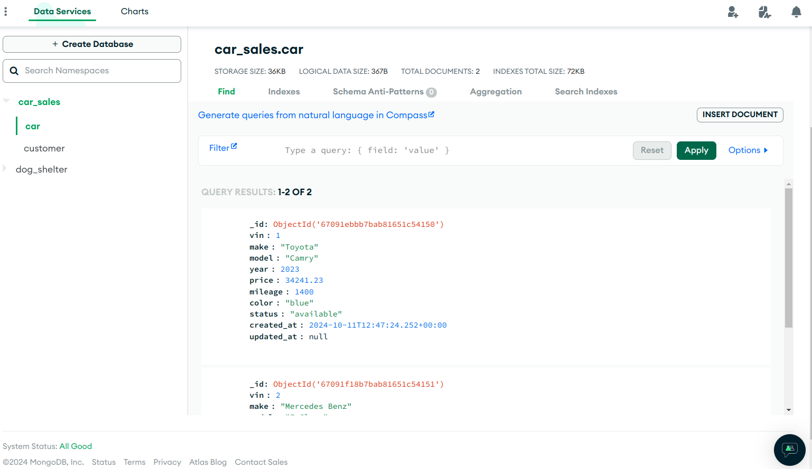

### Basic Car-sales endpoint API (showing use of [Beanie](https://beanie-odm.dev/))
> This API uses Mongo ATLAS DB, & FastAPI backend. To get started quickly, create a `.env` file in the root directory
> and set the following variables.
> 
> MONGO_URI="xxx"
> 
> DB_NAME="xxx"
> 
> The MONGO_URI is your Mongo Atlas connection string, then the database-name.


### API Endpoints:
This project provides a RESTful API for managing user data. The following endpoints are available:
> [!NOTE]
> Base endpoint __localhost:8000/api/v1/...__ 

1. car endpoint :white_check_mark:
 - [x] POST /car/
 - [x] GET /car/
 - [x] GET /car/list/
 - [x] PATCH /car/update/ (price, status etc.)
 - [x] DELETE /car/delete/

2. customer endpoint :white_check_mark:
 - [x] POST /customer/
 - [x] GET /customer/
 - [x] GET /customer/list/
 - [x] PATCH /customer/update/
 - [x] DELETE /customer/delete/

3. order endpoint :x:
 - [ ] POST /order/
 - [ ] GET /order/
 - [ ] GET /order/list/
 - [ ] PATCH /order/update/

___
### Customer JSON formats
1. Create new customer
```json
{
    "email": "mtn@xyz.com",
    "name": "mtn",
    "phone": "+1-234-567-9999",
    "address": "House 5B, Ajanaku cresent, Ikoyi"
}
```

2. Retrieve/Delete a single Customer (Would retrieve by ID after adding auth)
```json
{
  "email": "mtn@xyz.com"
}
```

3. Update a single Customer (Email field is mandatory, others are optional)
```json
{
    "email": "mtn@xyz.com",
    "name": "mtn",
    "phone": "+1-234-567-9999",
    "address": "House 5B, Ajanaku cresent, Ikoyi"
}
```

___

### Car Json formats
1. Create new Car
> *Color options*: (black, white, red, green, blue)
>
> *Status options*: (available, sold, unavailable)
```json
{
  "vin": 1,
  "make": "Toyota",
  "model": "Camry",
  "year": 2023,
  "price": 34241.23,
  "mileage": 1400,
  "color": "blue",
  "status": "available"
}
```

2. Retrieve/Delete single car
```json
{
  "vin": 1
}
```

3. Update car (VIN is mandatory, others are optional)
```json
{
  "vin": 1,
  "price": 380000,
  "status": "sold"
}
```

---
### Order JSON formats
1. Create a new order


## TODO :soon:
- add logging
- add tests
- add CI/CD
- add authentication